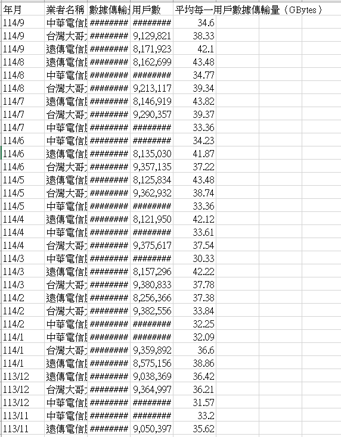
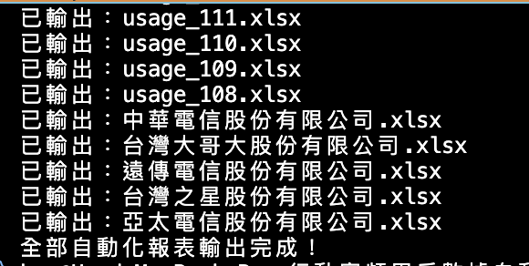
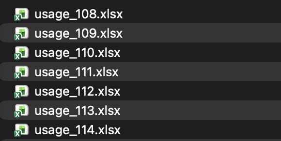
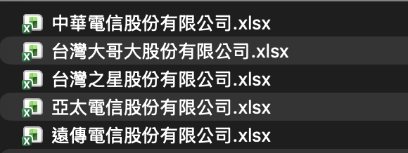
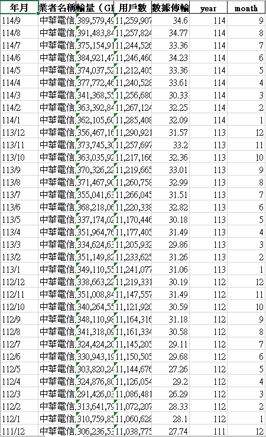

# 行動寬頻用戶數據自動分類與報表生成工具（Python 自動化）

本專案透過 Python 自動化處理「行動寬頻用戶每月平均數據用量」資料，
能自動將原始 CSV 檔依 **年份** 與 **電信業者** 自動切分，並輸出乾淨的 Excel 報表。

此專案模擬真實企業常見的資料處理流程，可應用於：
- 月報／年報自動化
- 部門資料分檔
- 大量資料清理與拆分
- 自動產生多份報表

> 本專案可直接於本機執行，或使用**Docker**以避免環境差異
---

來源:

資料集：行動寬頻用戶每月平均數據用量  
來源：政府資料開放平台 (data.gov.tw)  
網址：https://data.gov.tw/dataset/30770

---
## Docker使用

*Step 1*

```
docker build -t telecom-report .
```

*Step 2*

```
docker run telecom-report
```


---
## 結果展示

原始資料排列混亂複雜




---
經分類與排序後








依照年份


依照業者





---


---

